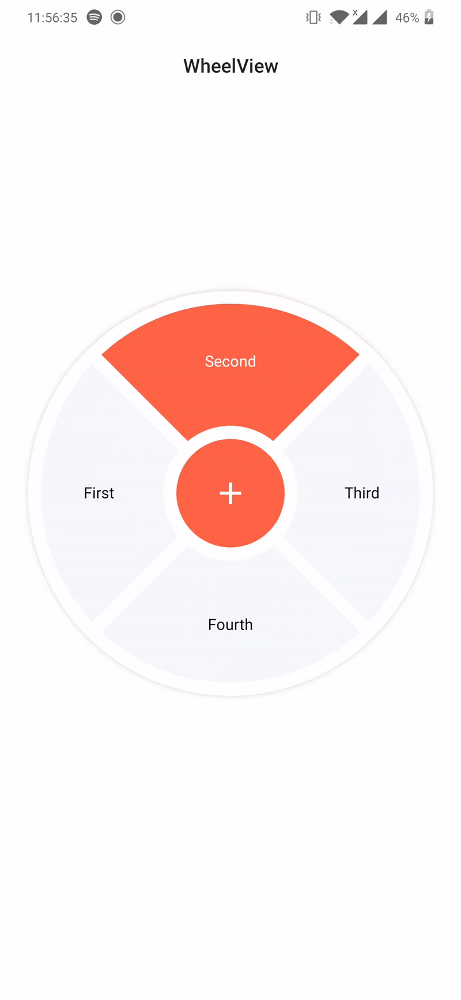
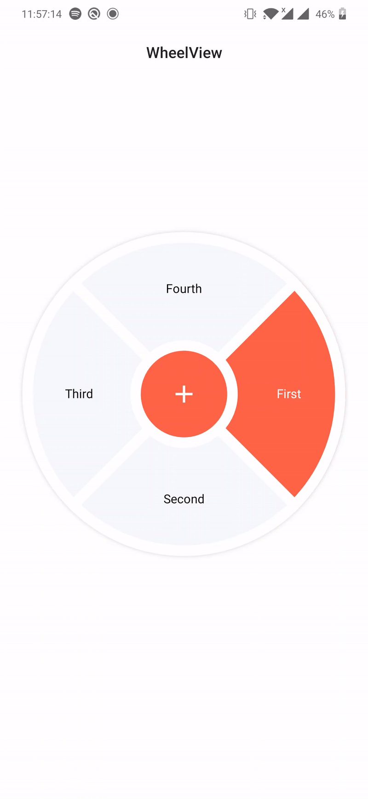

# WheelView  
Android UI library to create wheels
  
[](https://www.gnu.org/licenses/gpl-3.0) [](https://jitpack.io/#psuzn/WheelView)  [](https://source.android.com/setup/start/build-numbers)  
  <br>
&ensp;&ensp;&ensp;&ensp;&ensp;  
ANIMATE_TO_ANCHOR   &ensp;&ensp;&ensp;&ensp;&ensp;&ensp;&ensp;&ensp;&ensp;&ensp; &ensp;  STATIC
## Usage  
#### Set up the dependency  
1. Add the JitPack repository to your root build.gradle at the end of repositories:  
```  
allprojects {  
   repositories {  
      ...  
      maven { url 'https://jitpack.io' }  
   }  
}  
```  
2. Add  dependency in the build.gradle:  
```  
implementation 'com.github.psuzn:WheelView:0.1.0'  
```  
  
#### Use a `WheelView`  in your layout.  
```xml  
  <me.sujanpoudel.wheelview.WheelView
        android:id="@+id/wheel_view"
        android:layout_width="match_parent"
        android:layout_height="match_parent"
        android:layout_margin="16dp"
        app:wheelDividerStrokeWidth="16dp"
        app:wheelArcBackgroundColor="#F7F8FB"
        app:wheelSelectedArcBackgroundColor="#FE6447"
        app:wheelCenterIcon="@drawable/ic_baseline_add_24"
        app:wheelCenterIconPadding="16dp"
        app:wheelCenterIconTint="@color/white"
        app:wheelAnchorAngle="270"
        app:wheelStartAngle="315"
        app:wheelTextSize="16sp"
        app:wheelSelectedTextColor="#FFF"
        app:wheelTextColor="#000000"
        app:wheelAnimationDuration="800"
        app:wheelMode="ANIMATE_TO_ANCHOR"
        />
```  
  
#### Setup arc titles
```kotlin
...
setContentView(R.layout.activity_main)  
val wheelView = findViewById<WheelView>(R.id.wheel_view)  
wheelView.titles = listOf("First", "Second", "Third", "Fourth")
...
```  
## Customization
You can customize following properties:


<br />
<br />

```xml
  <me.sujanpoudel.wheelview.WheelView
        android:id="@+id/wheel_view"
        android:layout_width="match_parent"
        android:layout_height="match_parent"
        android:layout_margin="16dp"

        app:wheelDividerStrokeWidth="16dp"
        app:wheelArcBackgroundColor="#F7F8FB"
        app:wheelSelectedArcBackgroundColor="#FE6447"
        app:wheelCenterIcon="@drawable/ic_baseline_add_24"
        app:wheelCenterIconPadding="16dp"
        app:wheelCenterIconTint="@color/white"
        app:wheelAnchorAngle="270"
        app:wheelStartAngle="315"
        app:wheelTextSize="16sp"
        app:wheelSelectedTextColor="#FFF"
        app:wheelTextColor="#000000"
        app:wheelAnimationDuration="800"
        app:wheelMode="ANIMATE_TO_ANCHOR"
        />
```
##### 1.  Wheel Mode

The `WheelView` has  two [modes](#mode)
  ```kotlin
  enum class Mode {  
	  ANIMATE_TO_ANCHOR,  // the selected arc segment animates and moves to anchor angle like  
	  STATIC  // only the selected 
}
  
  ```
##### 1.  Arc Segment Divider Stroke Width 
```xml
<me.sujanpoudel.wheelview.WheelView
    app:wheelDividerStrokeWidth="16dp"
    ...
   ```
##### 2.  Arc Segment Background Color
```xml
<me.sujanpoudel.wheelview.WheelView
    app:wheelArcBackgroundColor="#F7F8FB"
    app:wheelSelectedArcBackgroundColor="#FE6447"
  ...
   ```
##### 3. Center Icon  
```xml
<me.sujanpoudel.wheelview.WheelView
    app:wheelCenterIcon="@drawable/ic_baseline_add_24"
    app:wheelCenterIconPadding="16dp"
    app:wheelCenterIconTint="@color/white"
  ...
   ```

##### 4. Mode, Angle and Animation 
```xml
<me.sujanpoudel.wheelview.WheelView
      app:wheelAnchorAngle="270"
      app:wheelStartAngle="315"
      app:wheelAnimationDuration="800"
      app:wheelMode="ANIMATE_TO_ANCHOR|STATIC"
  ...
   ```
##### 4. Text 
```xml
<me.sujanpoudel.wheelview.WheelView
    app:wheelTextSize="16sp"
    app:wheelSelectedTextColor="#FFF"
    app:wheelTextColor="#000000"
  ...
   ```

## Bugs and Feedback  
For bugs, questions and discussions please use the [Github Issues](https://github.com/psuzn/WheelView/issues/new).  
  
## License  
```  
Copyright 2020 @psuzn

Licensed under the Apache License, Version 2.0 (the "License");
you may not use this file except in compliance with the License.
You may obtain a copy of the License at

    http://www.apache.org/licenses/LICENSE-2.0

Unless required by applicable law or agreed to in writing, software
distributed under the License is distributed on an "AS IS" BASIS,
WITHOUT WARRANTIES OR CONDITIONS OF ANY KIND, either express or implied.
See the License for the specific language governing permissions and
limitations under the License.
```